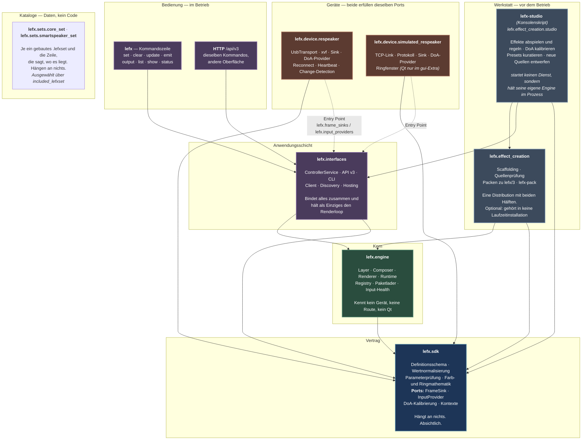
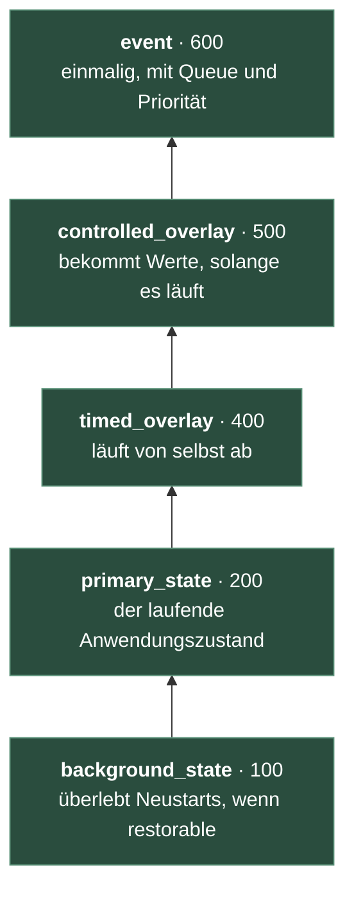
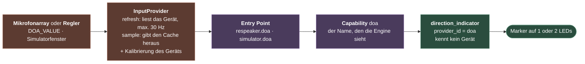
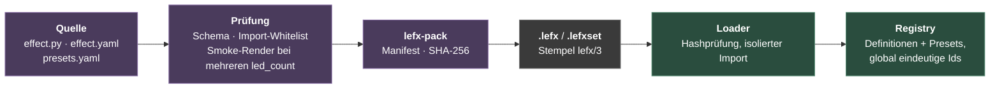

# LEFX V3 — das System auf einen Blick

Sieben Distributionen, ein Vertrag, zwei austauschbare Geräte. Diese Seite ist
der Einstieg: sie zeigt, welches Paket welche Rolle hat, in welche Richtung die
Abhängigkeiten zeigen — und warum an einer Stelle bewusst *keine* Abhängigkeit
steht, obwohl dort etwas zusammenarbeitet.

---

## Das große Bild



**Durchgezogen** heißt „importiert" — eine Abhängigkeit, die in der
`pyproject.toml` steht und ohne die das Paket nicht installierbar ist.
**Gestrichelt** heißt „wird zur Laufzeit über Entry Points gefunden, ohne
importiert zu werden".

Die Werkstatt steht bewusst neben der Bedienung, nicht darin. `lefx` und die
HTTP-API steuern einen **laufenden Dienst** — das ist der Betrieb. Studio und
`led-controller-version-3-effect-creation` entstehen und arbeiten **davor**: sie entwerfen, prüfen und
bauen, was der Dienst später lädt, und keines von beidem gehört in eine
Installation, die nur Effekte abspielen soll. Das Studio startet dafür auch
keinen Dienst, sondern hält seine eigene Engine — deshalb kann es eine Quelle
rendern, die noch gar nicht gebaut ist.

Die beiden Pfeilarten zeigen bei den Geräten in **entgegengesetzte Richtungen**,
und das ist der Kern der Architektur: Ein Gerät hängt am SDK und sonst an
nichts. Der Dienst hängt *nicht* am Gerät — er liest die Entry Points aus den
installierten Paketmetadaten. Wer den Simulator nicht installiert, hat ihn
nicht, und es gibt keine Codezeile, die man dafür vergessen könnte.

---

## Die acht Schichten in drei Distributionen

Was gebaut wird, sind drei Wheels. Was die Regeln beschreiben, sind acht
Schichten. Beides gehört zusammen, aber es ist nicht dasselbe: ein eigenes
Projekt bekommt nur, was auch wirklich optional ist.

| PyPI-Projekt | Installiert durch |
|---|---|
| `led-controller-version-3` | Standard |
| `led-controller-version-3-device-simulated-respeaker` | `[simulated-respeaker]` |
| `led-controller-version-3-effect-creation` | `[effect-creation]` |

| Schicht | Rolle | Darf importieren | Liegt in |
|---|---|---|---|
| **lefx.sdk** | Der Vertrag. Was ein Effekt deklarieren darf, wie Werte normalisiert werden, wie ein Gerät angesprochen wird. | — | `led-controller-version-3` |
| **lefx.engine** | Die Laufzeit. Layer, Komposition, Lebenszyklen, Registry, Paketformat `lefx/3`. | sdk | `led-controller-version-3` |
| **lefx.interfaces** | Die Steuerungsoberfläche: `ControllerService`, HTTP-API, CLI, Client, Discovery, Konfiguration. | sdk, engine | `led-controller-version-3` |
| **lefx.device.respeaker** | Die echte Hardware: USB-Transport, LED-Senke, DoA-Provider. | sdk | `led-controller-version-3` |
| **lefx.sets.core_set** | Der Referenzkatalog als gebautes `.lefxset`. | — | `led-controller-version-3` |
| **lefx.sets.smartspeaker_set** | Der Sprachassistenz-Katalog. | — | `led-controller-version-3` |
| **lefx.device.simulated_respeaker** | Das Software-Double: lokaler Transport, Ringfenster, simulierte DoA. | sdk | `led-controller-version-3-device-simulated-respeaker` |
| **lefx.effect_creation** | Alles zum Erstellen von Effekten: Gerüst, Prüfung, Bauen (`lefx-pack`) und die Desktop-Werkstatt (`lefx-studio`). | sdk, engine, interfaces | `led-controller-version-3-effect-creation` |

Die vier Laufzeitschichten und beide Kataloge liegen in einem Wheel, weil nie
eine Teilmenge davon installiert wird — kein Extra wählt zwischen ihnen, und
welche Kataloge geladen werden, entscheidet `included_lefxset` zur Laufzeit.
Getrennt wird nur, was auch getrennt installierbar sein muss.

### Die erlaubte Richtung

```text
lefx.sdk                         → (nichts)
lefx.engine                      → lefx.sdk
lefx.interfaces                  → lefx.sdk, lefx.engine
lefx.effect_creation             → lefx.sdk, lefx.engine, lefx.interfaces
lefx.device.respeaker            → lefx.sdk
lefx.device.simulated_respeaker  → lefx.sdk
lefx.sets.core_set               → (nichts)
lefx.sets.smartspeaker_set       → (nichts)
```

Innerhalb von `lefx.effect_creation` läuft eine zweite Grenze, weil Qt dort
harte Abhängigkeit ist: nichts direkt unter `lefx/effect_creation/` importiert
PySide6, und nichts dort importiert `studio/`. Eine Build-Strecke, die
`lefx-pack` aufruft, fasst den Toolkit also nie an. Auch das sind zwei Tests.

Diese Matrix ist keine Absichtserklärung, sondern ein Test:
`tests/architecture/test_architecture.py` parst die Importe **jeder** Quelldatei
jeder Schicht und bricht bei jeder Verletzung. Ein `from lefx.engine import …`
in `lefx.device.respeaker` würde problemlos funktionieren — beides liegt im
selben Wheel —, und genau deshalb hängt die Grenze an diesem Test und nicht am
Paketschnitt.

---

## Ein Frame, von der Eingabe bis zur LED

```mermaid
flowchart LR
    classDef iface fill:#4a3b5c,stroke:#8a6fa8,color:#fff
    classDef engine fill:#2a4d3e,stroke:#5b9279,color:#fff
    classDef sdk fill:#1d3557,stroke:#457b9d,color:#fff
    classDef dev fill:#5c3b31,stroke:#a86f5c,color:#fff

    CMD["<b>Kommando</b><br/>lefx set state ready_state<br/>oder POST /api/v3/set/state"]
    SVC["<b>ControllerService</b><br/>nimmt an, rendert sofort,<br/>persistiert Background-State"]
    RT["<b>Runtime</b><br/>löst Namen auf, prüft Werte,<br/>legt eine Invocation auf ihren Layer"]
    ST["<b>LayerStore</b><br/>fünf Plätze, Event-Queue,<br/>brightness · enabled"]
    CMP["<b>Composer</b><br/>ruft render je Layer,<br/>zieht Runtime-Inputs"]
    RND["<b>Renderer</b><br/>legt die Layer übereinander,<br/>None lässt durch, skaliert global"]
    FRAME["<b>OutputFrame</b><br/>led_count deckende RGB-Ints<br/>+ Zeitstempel"]
    SINK["<b>FrameSink</b><br/>respeaker · simulator · null"]
    RING(["LED-Ring"])

    CMD --> SVC --> RT --> ST --> CMP --> RND --> FRAME --> SINK --> RING

    class CMD,SVC iface
    class RT,ST,CMP,RND engine
    class FRAME,SINK sdk
    class RING dev
```



Der Schnitt liegt bei `OutputFrame`. Alles links davon ist Komposition, alles
rechts davon ist Gerät — und die Senke bekommt nie etwas anderes als eine Liste
deckender Farben. Sie wirft dabei nicht: ein Kabel, das zwischen zwei Frames
gezogen wird, ist ein normaler Zustand und wird über `status()` gemeldet, nicht
über eine Exception in den Renderloop.

### Der Layerstapel



Von unten nach oben. Ein controlled overlay liegt **über** einem timed overlay,
weil eine laufende funktionale Anzeige sichtbar bleiben soll; was wirklich für
einen Moment alles verdecken muss, ist ein Event.

Welcher Layer bedient wird, folgt aus dem **Typ der Definition** — nicht aus
einem Feld, das man falsch setzen kann. Die vier Formen sind:

| Form | Verb | Kanal | Endet | Runtime-Inputs |
|---|---|---|---|---|
| `StateDefinition` | `set state` | — | nie | — |
| `TimedOverlayDefinition` | `set overlay` | — | selbst | — |
| `ControlledOverlayDefinition` | `set overlay --channel` | ja | nie | ja |
| `EventDefinition` | `emit event` | — | selbst | — |

---

## Der Weg zurück: Richtungsdaten

Der interessantere Pfad läuft andersherum — vom Gerät in den Effekt.



Drei Entscheidungen stecken in dieser Kette:

1. **Entry Points heißen `<gerät>.<fähigkeit>`.** Beide Pakete dürfen gleichzeitig
   installiert sein, ohne zu kollidieren.
2. **Die Engine sieht nur die Fähigkeit.** Eine Definition schreibt
   `provider_id="doa"` — nie `respeaker_doa`. Die Wahl der Senke wählt das Gerät,
   und dessen Provider erreicht die Engine unter dem nackten Fähigkeitsnamen.
   Derselbe Effekt läuft unverändert gegen Hardware und Simulator.
3. **`refresh` und `sample` sind getrennt.** Zehn Overlays, die die Richtung
   beobachten, kosten einen Gerätezugriff pro Intervall statt zehn pro Frame.

### Kalibrierung gehört zum Gerät

Mikrofonarray-Null und LED-Null sind auf einer echten Platine nicht dieselbe
Richtung — beim reSpeaker liegt der Kabelanschluss zwischen der zwölften und der
ersten LED. Diese Drehung ist eine **Eigenschaft des Geräts** und wird dort
angewandt, bevor die Peilung herausgegeben wird:

```text
doa_calibration.json   {"respeaker": {"angle_offset_deg": 129.1, "reverse": false}}
                        └─ pro Gerät, weil ein Simulator keinen Montagewinkel hat
```

Ein Effekt bekommt damit eine Peilung, die schon auf dem Ring liegt, und muss
nicht wissen, wie herum die Platine eingebaut wurde.

**Halbe LED-Schritte.** Eine Richtung trifft genauso oft *zwischen* zwei LEDs wie
auf eine. Der Ring wird deshalb in `2 × led_count` Sektoren gelesen — bei zwölf
LEDs also 15° — und eine Zwischenrichtung leuchtet auf beiden Nachbarn mit
halber Helligkeit, statt auf die nächstgelegene gerundet zu werden.

---

## Effekte: von der Quelle ins laufende System



Eine ungültige Definition ist **nicht konstruierbar** — die Prüfungen laufen in
`__post_init__` der typ-spezifischen Definitionsklassen, nicht in einem
Validator, den man vergessen kann aufzurufen. Der Import-Whitelist gilt dabei
nur für Effektquellen; Gerätepakete sind normale Distributionen und dürfen
`usb`, `socket` und `PySide6` verwenden.

---

## Zwei Geräte, ein Vertrag

|  | Hardware | Simulator |
|---|---|---|
| Ports | identisch | identisch |
| DoA-Format und -Wertebereich | identisch | identisch |
| Fähigkeitsname für die Engine | `doa` | `doa` |
| Konformitätssuite | dieselbe | dieselbe |
| Kalibrierung | dieselbe Mechanik | dieselbe Mechanik |
| Transport | USB, Reconnect-Thread, Heartbeat | TCP-Loopback, Verbindung optional |
| Ausgabe | Change-Detection (USB-Writes sind teuer) | jeder Frame wird gesendet |
| Nicht verfügbar | Kabel ab → `available=False` | Fenster zu → `available=False` |
| Schwere Abhängigkeit | `pyusb`, `libusb-package` | `PySide6` nur im `gui`-Extra |

Die ersten fünf Zeilen sind der Punkt: oberhalb der Ports darf kein Aufrufer
einen Unterschied sehen. Der Rest ist Innenleben.

Deshalb läuft `tests/device/test_device_contract.py` **parametrisiert über beide
Geräte** — gegen den Simulator immer, gegen die Hardware, wenn eine angeschlossen
ist. Die Suite ist die ausführbare Form des Port-Vertrags.

---

## Der Dienst ist auch eine Bibliothek

`ControllerService` ist einbettbar. Prozess-Hosting — Ports, PID-Datei, uvicorn —
liegt daneben in `hosting.py` und wird beim Einbetten schlicht nicht angefasst.
Das `lefx-studio` ist der Beweis dafür: es startet keinen Dienst, sondern hält
seine eigene Engine im Prozess.

```python
from lefx.interfaces import ControllerService

service = ControllerService(sink="simulator", led_count=12, fps=30.0)
service.start()
service.set_state("solid_fill", {"color": "#FF0000"})
```

Die Senke darf auch als **Objekt** übergeben werden statt als Name — so kann ein
Host die Frames mitlesen, die zum Gerät gehen, statt sie ein zweites Mal selbst
zu rendern.

---

## Wo was liegt

```text
respeaker-led-v3/
├── packages/
│   ├── led-controller-version-3/                     lefx.sdk · lefx.engine · lefx.interfaces
│   │                                    lefx.device.respeaker · lefx.sets.*
│   ├── led-controller-version-3-device-simulated-respeaker/
│   │                                    lefx.device.simulated_respeaker
│   └── led-controller-version-3-effect-creation/     lefx.effect_creation (+ .studio)
├── effects/
│   ├── core-set/                Quellen der kuratierten Referenzdefinitionen
│   └── smartspeaker-set/        Quellen des portierten Produktivsatzes
├── config.example.yaml          jede Einstellung, dokumentiert
├── scripts/
│   ├── build_effects.py         Quellen → .lefxset, in die Distribution hinein
│   ├── build_simulator.py       Ringfenster als Standalone
│   ├── build_studio.py          Studio als Standalone
│   ├── check_release.py         Artefakte bauen und installiert prüfen
│   ├── sync_release_tree.py     den Baum des Release-Repos materialisieren
│   └── release.py               Version, Prüfungen, CI-Gate, Tag
├── tests/
│   ├── sdk/ engine/ authoring/  je Paket
│   ├── catalogue/               jede Definition, mehrere Ringgrößen
│   ├── interfaces/ system/      Service, API, CLI, End-to-End
│   ├── device/                  Vertragssuite über beide Geräte
│   ├── studio/                  Sitzung, Widgets, Kalibrierung
│   └── architecture/            Paketgrenzen und V1-Regressionen
└── docs/
```

## Loslegen

```bash
uv sync
```

```bash
uv run python scripts/build_effects.py
```

```bash
uv run lefx serve --sink simulator
```

```bash
uv run lefx-studio --output simulator
```

Das Studio hat drei Seiten: **Player** (Katalog durchsuchen, Parameter regeln,
live zusehen, Presets sichern), **Kalibrierung** (24 Sektoren durchsteppen und
den Montagewinkel bestimmen) und **Neuer Effekt** (eine Definition entwerfen,
auf dem Gerät ansehen, als Quelle schreiben und zu `.lefx` bauen).

Der Katalog muss einmal gebaut sein, bevor ein Dienst startet — gebaute
Artefakte sind reproduzierbare Ausgabe und liegen nicht im Repository. Sie
landen unter `packages/led-controller-version-3/src/lefx/sets/<name>/`,
was im Checkout derselbe Ort ist wie in einem installierten Wheel. Gefunden
werden sie über den Entry-Point-Group `lefx.effect_sets`; `included_lefxset`
schränkt ein, welche davon geladen werden, und `package_path` kommt hinzu.
