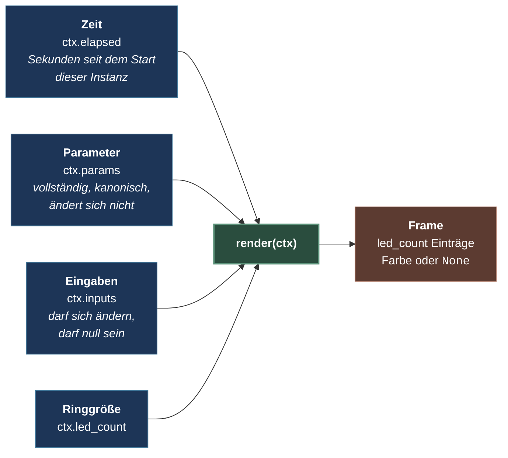

# 01 — Grundidee

> Teil I, Kapitel 1. Weiter: [Layer und Komposition](02-layer-und-komposition.md)

Ein Effekt in LEFX ist eine **Funktion**, keine Anwendung. Er bekommt vier
Dinge und gibt eine Liste von Farben zurück. Das ist die ganze Idee; alles
Weitere in diesem System folgt daraus.



Was in diesem Bild **nicht** vorkommt, ist wichtiger als was drinsteht. Ein
Effekt kennt kein Gerät, keine Uhr, keine Konfigurationsdatei, keinen anderen
Effekt und keinen Zustand der Anwendung. Er kann nichts davon versehentlich
benutzen, weil ihm nichts davon gereicht wird.

---

## Wer beantwortet was

Drei Fragen stecken in jedem Bild auf einem LED-Ring, und in LEFX beantwortet
sie jeweils jemand anderes:

| Frage | Antwort von | Beispiel |
|---|---|---|
| **Was** soll gezeigt werden? | Der Anwendung | „Wir hören gerade zu" |
| **Wie** sieht das aus? | Dem Effekt | ein atmender blauer Ring |
| **Wann** und **worüber**? | Der Engine | jetzt, auf dem State-Layer, über dem Hintergrund |

Diese Trennung ist der Grund, warum sich dieselbe Anwendung ohne Codeänderung
anders anfühlen kann — man tauscht den Effekt aus, nicht das Programm. Und sie
ist der Grund, warum ein Effekt so wenig kennt: er wird jedes Mal gefragt „wie
sieht dieser Moment aus" und antwortet mit Farben. Mehr nicht.

## Ein vollständiger Effekt

So klein ist das wirklich:

```python
class SolidFill(BaseEffect):
    definition = StateDefinition(
        id="solid_fill",
        title="Solid Fill",
        description="Der ganze Ring in einer Farbe.",
        parameter_schema={
            "color": ParamDefinition(name="color", type=ParamType.COLOR, default="#3399FF"),
            "brightness": ParamDefinition(
                name="brightness", type=ParamType.FLOAT, default=0.8,
                minimum=0.0, maximum=1.0,
            ),
        },
        color_model=ColorModel.MONO,
    )

    def render(self, ctx: RenderContext) -> list[int | None]:
        color = scale_color(parse_color(ctx.params["color"]), ctx.params["brightness"])
        return [color] * ctx.led_count
```

Zwei Teile: eine **Definition**, die den Vertrag deklariert, und ein
**`render`**, das ihn erfüllt. Die Definition sagt, welche Parameter es gibt,
welche Typen sie haben und was ohne Angabe gilt. `render` bekommt die Werte
dann fertig geprüft und umgerechnet.

Beachte, was in `render` fehlt: kein `if color is None`, kein
`color.lstrip("#")`, kein `max(0.0, min(1.0, brightness))`. Der Wert ist beim
Ankommen schon eine kanonische Farbe und eine Zahl im deklarierten Bereich —
weil die Definition das erzwingt. Genau diese Prüfungen in jedem Paket
nachzubauen war der Zustand, den diese Generation abgeschafft hat.

## Vier Zusagen, auf die sich ein Effekt verlassen darf

1. **`params` ist vollständig und kanonisch.** Jeder deklarierte Schlüssel ist
   da, im deklarierten Typ, innerhalb der deklarierten Grenzen. Keine
   Fallbacks nötig.
2. **`elapsed` ist eine Zeit, kein Zähler.** Sekunden seit dem Start *dieser
   Instanz*, aus einer monotonen Uhr. Eine Animation sieht bei 8 und bei 60
   Bildern pro Sekunde gleich aus, und eine Zeitumstellung stört sie nicht.
3. **`led_count` ist eine Zahl, keine Konstante.** Der Ring hat, was die
   Konfiguration sagt. Ein Effekt, der zwölf annimmt, ist schlicht kaputt.
4. **`inputs` darf `null` sein.** Bei einem Controlled Overlay heißt das: noch
   nichts angekommen, oder die Quelle ist verstummt. Was das anzeigt,
   entscheidet der Effekt — die Engine malt dafür nichts Eigenes.

Und eine Zusage in die andere Richtung: **`render` gibt genau `led_count`
Einträge zurück.** Jeder Eintrag ist eine deckende Farbe oder `None`. Was das
`None` bedeutet, ist das Thema des nächsten Kapitels.

## Was ein Effekt nicht tut

| Nicht | Sondern |
|---|---|
| Ein Gerät ansprechen | Die Engine schickt das fertige Bild dorthin |
| Selbst Zeit messen | `ctx.elapsed` fragen |
| Werte umrechnen oder prüfen | Im Schema deklarieren |
| Sich zwischen Frames etwas merken | Aus `elapsed` und `params` neu ausrechnen |
| Sich selbst beenden | Nur die Engine beendet etwas ([Kapitel 03](03-lebenszyklusformen.md)) |
| Andere Effekte kennen | Layer übereinanderlegen ist Sache der Engine |

Die letzte Zeile hat eine praktische Folge, die überrascht: ein Effekt, der eine
Richtung anzeigt, fragt kein Mikrofon. Er *deklariert*, dass er die Fähigkeit
`doa` liest, und bekommt Werte gereicht. Zehn laufende Kopien dieses Effekts
verursachen deshalb einen Gerätezugriff pro Intervall, nicht zehn pro Bild — und
derselbe Effekt läuft unverändert gegen echte Hardware und gegen den Simulator.

## Warum das die Mühe wert ist

Ein Effekt, der nur diese Funktion ist, hat Eigenschaften, die man sonst
mühsam herstellen müsste:

- **Er ist prüfbar.** Ein Frame ist eine Liste; man ruft `render` mit einer Zeit
  auf und schaut sie an. Der Katalogtest rendert jede Definition bei mehreren
  Ringgrößen und mehreren Zeitpunkten, ohne dass irgendwo ein Gerät beteiligt
  ist.
- **Er ist austauschbar.** Weil er nichts über die Umgebung annimmt, läuft er
  überall gleich — auf dem Ring, im Simulator, in einem Test.
- **Er kann den Dienst nicht mitreißen.** Er hält keine Verbindung, keinen
  Thread, keine Datei.
- **Er ist verteilbar.** Ein Effekt ist ein Paket, das man bauen, signieren,
  kopieren und laden kann, ohne die Anwendung anzufassen.

## Der Weg eines Bildes

Der Vollständigkeit halber, in einem Satz pro Station: Ein Kommando kommt über
CLI oder HTTP an, die Runtime löst den Namen auf, prüft die Werte und legt eine
**Invocation** auf ihren Layer. Der Composer ruft pro Layer `render`. Der
Renderer legt die Ergebnisse übereinander und wendet die globalen
Ausgabeeinstellungen an. Das Ergebnis geht als `OutputFrame` an das Gerät.

Ausführlich steht dieser Weg in [index.md](../index.md); die beiden nächsten
Kapitel nehmen die mittleren beiden Stationen auseinander.

---

## Kernsätze

- Ein Effekt ist eine Funktion von Zeit, Parametern, Eingaben und Ringgröße auf
  eine Liste von Farben.
- Die Anwendung sagt *was*, der Effekt sagt *wie*, die Engine sagt *wann* und
  *worüber*.
- Was ein Effekt nicht gereicht bekommt, kann er nicht falsch benutzen.
- Werte werden deklariert, nicht im Paket geprüft.

> Weiter: [02 — Layer und Komposition](02-layer-und-komposition.md)
