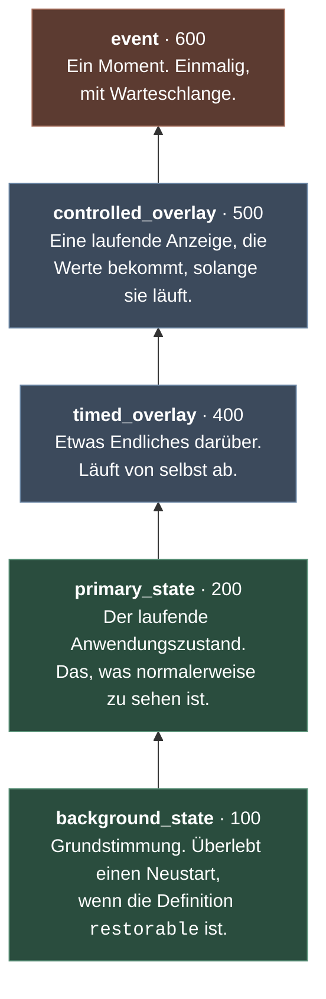

# 02 — Layer und Komposition

> Teil I, Kapitel 2. Zurück: [Grundidee](01-grundidee.md) · Weiter: [Lebenszyklusformen](03-lebenszyklusformen.md)

Mehrere Effekte laufen gleichzeitig. Ein Zustand zeigt an, dass zugehört wird,
darüber markiert etwas die Richtung, und für einen Moment blitzt eine
Bestätigung auf. Wie daraus **ein** Bild wird, entscheidet ein Mechanismus mit
genau einer Regel.

---

## Der Frame

Ein Frame ist eine Liste mit `led_count` Einträgen. Jeder Eintrag ist eins von
zwei Dingen:

| Eintrag | Bedeutung |
|---|---|
| `0xRRGGBB` | **Eine Farbe.** Deckt zu, was darunter liegt. |
| `None` | **Nichts beizutragen.** Was darunter liegt, bleibt stehen. |

Das ist die eine Regel. Und der Unterschied, der am häufigsten missverstanden
wird, steckt in ihr:

> **`None` ist nicht Schwarz.** `None` heißt „ich sage zu dieser Position
> nichts". `0x000000` ist eine Farbe wie jede andere und verdeckt, was darunter
> liegt.

Ein Effekt, der die ganze Fläche schwarz malt, blendet die Ebenen darunter aus.
Ein Effekt, der überall `None` zurückgibt, ist unsichtbar. Beides ist manchmal
gewollt — nur eben nicht dasselbe.

Dafür gibt es zwei Hilfen im Kontext:

```python
ctx.transparent_frame()   # [None, None, …]  — ändert nichts
ctx.blank_frame()         # [0, 0, …]        — deckt alles zu, in Schwarz
```

## Der Stapel

Fünf Plätze, von unten nach oben:



Jeder Platz hält **höchstens eine** laufende Instanz. Ein neuer State auf dem
primären Platz ersetzt den vorherigen; es gibt keine zwei gleichzeitigen
primären States.

Zwei Anordnungen sind bewusst so und nicht anders:

**Controlled über Timed.** Eine laufende funktionale Anzeige — ein Pegel, eine
Richtung — soll sichtbar bleiben. Was wirklich für einen Moment alles verdecken
muss, ist ein Event, und das liegt darüber.

**Zwei State-Plätze.** Der Hintergrund ist die Grundstimmung des Geräts, die
über Neustarts hinweg gilt. Der primäre State ist das, was die Anwendung gerade
tut. Beide gleichzeitig zu haben heißt: ein transparenter Zustand kann die
Grundstimmung durchscheinen lassen, statt sie zu ersetzen und später
wiederherstellen zu müssen.

## Keine freie Layerwahl

Ein Aufrufer sucht sich den Layer **nicht** aus. Er folgt aus dem Typ der
Definition:

| Definition | Layer |
|---|---|
| `StateDefinition` | `primary_state` oder `background_state`, je nach `slot` |
| `TimedOverlayDefinition` | `timed_overlay` |
| `ControlledOverlayDefinition` | `controlled_overlay` |
| `EventDefinition` | `event` |

Das ist eine Entscheidung gegen Flexibilität, und zwar mit Absicht. Wäre der
Layer frei wählbar, wäre „was liegt über was" eine Eigenschaft jedes einzelnen
Aufrufs und nirgends nachlesbar. So ist die Schichtung eine Eigenschaft des
Systems, die man einmal versteht.

Ein State kann wählen, ob er im Vordergrund oder im Hintergrund liegt — aber nur
unter den Plätzen, die seine Definition in `slots` anbietet.

## Die Komposition, an einem Beispiel

Drei Ebenen, sechs LEDs, damit es in eine Tabelle passt:

| Ebene | 0 | 1 | 2 | 3 | 4 | 5 |
|---|---|---|---|---|---|---|
| `background_state` — aus | – | – | – | – | – | – |
| `primary_state` — Rot, opaque | 🟥 | 🟥 | 🟥 | 🟥 | 🟥 | 🟥 |
| `controlled_overlay` — Richtung, transparent | `None` | `None` | 🟩 | `None` | `None` | `None` |
| `event` — nichts aktiv | `None` | `None` | `None` | `None` | `None` | `None` |
| **Ergebnis** | 🟥 | 🟥 | **🟩** | 🟥 | 🟥 | 🟥 |

Von unten nach oben, jede Farbe überschreibt, jedes `None` lässt durch. Der
Richtungsmarker sitzt auf dem State, ohne ihn zu löschen — und genau das ist der
ganze Mechanismus dahinter. Kein Sonderfall, keine Alphawerte, keine
Mischformel.


## Opaque und transparent

Jede Definition deklariert, welche Sorte sie ist:

```python
composition=CompositionMode.OPAQUE       # füllt jede Position
composition=CompositionMode.TRANSPARENT  # darf None zurückgeben
```

Das ist kein Hinweis, sondern eine Zusage, die geprüft wird: Ein **opaker**
Effekt muss jede Position füllen. Gibt er irgendwo `None` zurück, schlägt die
Prüfung fehl — bei der Quellenvalidierung und im Katalogtest, nicht erst dann,
wenn eine Lücke auf dem Ring auffällt.

Umgekehrt gilt das nicht: ein transparenter Effekt *darf* alles füllen. Er
verspricht nur, dass er es nicht muss.

Als Faustregel: **States sind opak, Overlays und Events sind transparent.** Ein
State ist die Grundlage und soll eine sein; alles darüber legt sich auf etwas.

## Die globalen Einstellungen

Nach der Komposition — und nur dort — wirken zwei Regler, die der Installation
gehören und keinem Effekt:

| Einstellung | Wirkung |
|---|---|
| `enabled: false` | Der ganze Frame wird schwarz. Die Layer bleiben belegt. |
| `brightness: 0.0 … 1.0` | Jede Farbe wird skaliert. |

Der zweite Satz in der Tabelle ist der wichtige. **Output aus ist nicht das
Gleiche wie Layer leeren.** Der State läuft weiter, die Animation läuft weiter,
der Status meldet weiterhin, was gesetzt ist — es kommt nur nichts an. Wieder
eingeschaltet, ist alles da, ohne dass die Anwendung etwas erneut setzen muss.

Und weil das *nach* der Komposition passiert, sieht ein Effekt die Helligkeit
nie. Er rendert immer in voller Stärke; dass gedimmt wird, ist nicht sein
Thema.

## Was der Frame nicht enthält

Am Ende der Kette steht ein `OutputFrame`, und in dem sind **keine `None` mehr**
— jede Position ist eine deckende Farbe. `None` ist ein Kompositionsbegriff und
endet an der Grenze zum Gerät. Eine Senke bekommt nie etwas, das sie
interpretieren müsste.

```python
@dataclass(slots=True, frozen=True)
class OutputFrame:
    leds: tuple[int, ...]   # genau led_count deckende RGB-Ints
    timestamp: float
```

---

## Kernsätze

- Ein Frame ist eine Liste aus Farben und `None`.
- `None` heißt „nichts beitragen"; Schwarz ist eine Farbe und deckt zu.
- Fünf Plätze, je eine Instanz, Reihenfolge fest — der Layer folgt aus dem Typ.
- Von unten nach oben komponieren, dann global dimmen oder abschalten.
- Am Gerät kommt nur noch Deckendes an.

> Weiter: [03 — Lebenszyklusformen](03-lebenszyklusformen.md)
