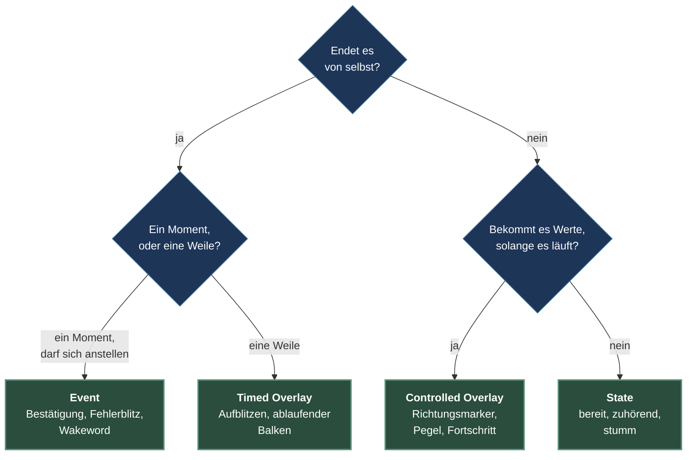
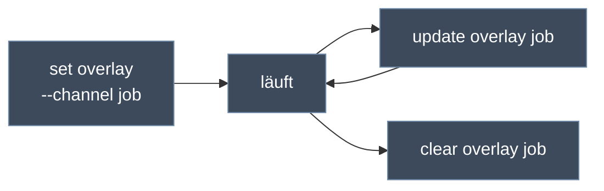
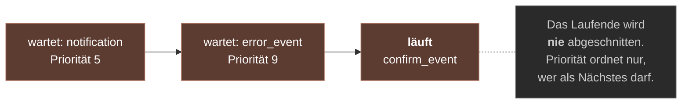

# 03 — Lebenszyklusformen

> Teil I, Kapitel 3. Zurück: [Layer und Komposition](02-layer-und-komposition.md) · Weiter: Teil II — [Definitionsschema](../effekte/04-definitionsschema.md)

Es gibt vier Formen, und die Frage, welche man braucht, hat genau eine
Dimension: **wie das Ding anfängt und wie es aufhört.** Alles andere — Layer,
Kommando, ob es einen Kanal gibt, ob es Werte empfangen kann — folgt daraus.

---

## Die Entscheidung



Zwei Fragen, im Zweifel diese: *Wer beendet es?* und *Ändert sich etwas daran,
während es läuft?*

## Der Vergleich

| | State | Controlled Overlay | Timed Overlay | Event |
|---|---|---|---|---|
| **Kommando** | `set state` | `set overlay --channel` | `set overlay` | `emit event` |
| **Layer** | primary / background | controlled_overlay | timed_overlay | event |
| **Beginnt** | wenn gesetzt | wenn gesetzt | wenn gesetzt | wenn dran |
| **Endet** | wenn ersetzt oder geleert | wenn der Kanal geleert wird | wenn die Zeit um ist | wenn die Zeit um ist |
| **Dauer** | keine | keine | Pflicht | Pflicht |
| **Kanal** | – | ja | – | – |
| **Runtime-Eingaben** | – | ja | – | – |
| **Warteschlange** | – | – | – | ja, mit Priorität |
| **Komposition** | meist opak | transparent | transparent | transparent |

Die Zeile, die alles erklärt, ist **Endet**. Zwei Formen enden von selbst, zwei
nicht — und nur die, die nicht von selbst enden, kann man sinnvoll ansprechen,
während sie laufen.

---

## State

Der Grundzustand. Er wird gesetzt und bleibt, bis etwas anderes gesetzt oder
der Platz geleert wird. Keine Dauer, keine Laufzeitwerte.

```bash
lefx set state listening
lefx set state solid_fill --slot background --config '{"color":"#101820"}'
lefx clear state
```

**Zwei Plätze.** Eine State-Definition deklariert in `slots`, wo sie liegen
darf. Der Hintergrund ist die Grundstimmung des Geräts, der primäre Platz das,
was die Anwendung gerade tut.

**`restorable`** — nur im Hintergrund sinnvoll und nur dort erlaubt. Ein so
markierter Hintergrundzustand wird gespeichert und beim nächsten Start
wiederhergestellt. Der primäre State wird bewusst *nicht* persistiert: was die
Anwendung tut, weiß die Anwendung, nicht der Dienst.

```python
slots=(StateSlot.PRIMARY, StateSlot.BACKGROUND)
restorable=True     # verlangt BACKGROUND in slots
```

---

## Controlled Overlay

Die einzige Form, die Werte bekommt, während sie läuft — und deshalb die
einzige mit einem **Kanal**. Der Kanal ist der Name, unter dem man sie später
wieder anspricht.

```bash
lefx set overlay level_meter --channel job --inputs '{"progress": 0}'
lefx update overlay job --inputs '{"progress": 60}'
lefx clear overlay job
```



Woher die Werte kommen, entscheidet die **Sampling-Politik**:

| Modus | Wer liefert | Beispiel |
|---|---|---|
| `PUSH` | Ein Aufrufer, per `update` | ein Fortschritt aus der Anwendung |
| `PULL` | Ein Provider, den die Definition per Fähigkeit benennt | `provider_id="doa"` |

Beim Pull-Modus nennt die Definition eine **Fähigkeit**, kein Gerät —
`"doa"`, nicht `"respeaker_doa"`. Welches Gerät sie erfüllt, entscheidet sich
beim Start des Dienstes. Derselbe Effekt läuft dadurch unverändert gegen
Hardware und Simulator.

**Werte dürfen `null` sein.** Vor der ersten Lieferung, und wieder, wenn eine
Quelle verstummt. Der Effekt entscheidet, was er dann zeigt; die Engine malt
nichts Eigenes und beendet die Instanz auch nicht. Wie lange „noch da" gilt,
regelt die Karenzzeit — Thema von [Kapitel 06](../effekte/06-runtime-eingaben.md).

---

## Timed Overlay

Etwas Endliches über dem Zustand, das niemand wieder abräumen muss. Kein Kanal,
keine Laufzeitwerte — Anfang und Ende stehen beim Auslösen fest.

```bash
lefx set overlay fade_flash --config '{"color":"#FFFFFF","duration_ms":600}'
```

Die Länge ist ein **Pflichtparameter**, und die Definition sagt, wie er heißt:

```python
duration_field=DurationField.DURATION_MS   # verlangt config.duration_ms
duration_field=DurationField.TOTAL_MS      # verlangt config.total_ms
```

Der Unterschied ist gedanklicher Art. `duration_ms` heißt „so lange dauert es".
`total_ms` heißt „so lang ist das Ganze" und passt zu allem, was einen
Fortschritt über eine bekannte Gesamtdauer zeigt.

---

## Event

Ein Moment: eine Bestätigung, ein Fehler, ein erkanntes Wakeword. Wird
ausgelöst, nicht gesetzt, und läuft ab.

```bash
lefx emit event confirm_event
lefx emit event error_event --priority 9
```

Es gibt nur einen Event-Platz, also brauchen mehrere Events eine Regel. Sie
lautet:



- **Höhere Priorität zuerst**, bei Gleichstand in der Reihenfolge des Eintreffens.
- **Ein laufendes Event wird nie unterbrochen.** Priorität entscheidet über die
  Warteschlange, nicht über das, was gerade zu sehen ist.

Das ist eine bewusste Entscheidung gegen Zappeln. Ein Ereignis, das nach 80 ms
von einem wichtigeren weggeschoben wird, ist als Rückmeldung wertlos — man hat
es nicht gesehen und weiß nicht, ob es passiert ist.

Eine Definition kann eine `default_priority` mitbringen; ein `--priority` beim
Auslösen überschreibt sie.

---

## Nur die Engine beendet etwas

Bei allen vier Formen gilt dieselbe Regel, und sie ist wichtiger, als sie
klingt:

> Ein Paket sendet **kein** Fertig-Signal und kann seine eigene Instanz nicht
> beenden. Endliche Formen enden, weil die Engine ihre Zeit ablaufen sieht.

Der Grund ist, dass ein Effekt sonst zwei Dinge gleichzeitig wäre: eine
Darstellung und ein Stück Ablaufsteuerung. Ein Effekt, der sich selbst beenden
kann, kann es auch versäumen — und dann steckt ein Layer fest, aus einem Grund,
der in einem Paket liegt. So ist die Lebensdauer eine Eigenschaft der Deklaration
und für jede laufende Instanz von außen ablesbar.

Praktische Folge für `render`: Es gibt kein „letztes Bild". Der Effekt wird
gefragt, solange er läuft, und irgendwann nicht mehr. Ausblenden heißt, gegen
`ctx.elapsed` zu rechnen — nicht, ein Ende zu melden.

## Typische Einordnungen

| Das will ich zeigen | Form |
|---|---|
| Gerät ist bereit / hört zu / ist stumm | State |
| Ruhige Grundstimmung, auch nach Neustart | State im Hintergrund, `restorable` |
| Richtung, aus der gesprochen wird | Controlled Overlay, Pull |
| Fortschritt eines Downloads | Controlled Overlay, Push |
| Kurz weiß aufblitzen | Timed Overlay |
| Countdown über bekannte Gesamtdauer | Timed Overlay mit `total_ms` |
| „Verstanden" | Event |
| Fehler, der andere Meldungen überholen darf | Event mit hoher Priorität |

Wenn zwei Formen passen: Die Frage ist nicht, was schöner aussieht, sondern
**wer aufräumt**. Muss ein Aufrufer daran denken, das Ding wieder abzuräumen,
ist es ein State oder ein Controlled Overlay. Soll niemand daran denken müssen,
ist es endlich.

---

## Kernsätze

- Vier Formen, unterschieden nur danach, wie sie anfangen und aufhören.
- Nur das Controlled Overlay bekommt Werte im Betrieb — und hat deshalb als
  einziges einen Kanal.
- Endliche Formen deklarieren ihre Länge als Pflichtparameter.
- Ein laufendes Event wird nie abgeschnitten; Priorität ordnet die Warteschlange.
- Kein Paket beendet sich selbst.

> Teil I ist damit durch. Weiter mit Teil II: [04 — Definitionsschema](../effekte/04-definitionsschema.md)
